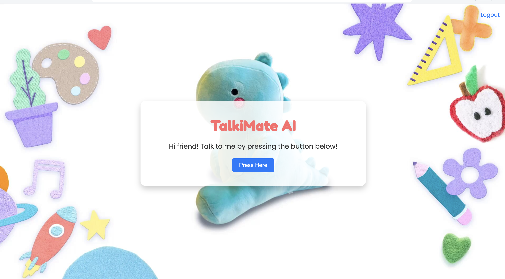

# TalkiMate-AI 🧸🤖



## Description 📖

TalkiMate AI is a voice assistant web application that uses OpenAI's GPT-3.5 Turbo for generating responses and Whisper for transcribing audio input. The app is designed with a simple, friendly user interface, featuring a playful design, making it suitable for children or casual use. Users can log in, speak to the AI, and receive both text and audio responses.

## Features 🛠️

- **Voice Interaction**: Speak to the AI and receive responses in both text and audio format.
- **User Authentication**: Register, log in, and log out functionalities with session management.
- **Responsive Design**: The application is optimized for all screen sizes, including mobile devices and tablets.
- **Overflow Handling**: Proper handling of large texts with scrollable containers.
- **Dynamic Background**: Features a playful, animated background design.

## Technologies Used 👨🏻‍💻

- **Flask**: Backend framework.
- **OpenAI GPT-3.5 Turbo**: For generating AI responses.
- **Whisper by OpenAI**: For transcribing audio inputs.
- **SQLAlchemy**: For user authentication and session management.
- **HTML/CSS/JavaScript**: Frontend design and interaction.
- **gTTS**: For generating voice responses.

## Getting Started

### Prerequisites ⚙️

- Python 3.7+
- Virtualenv (recommended)
- OpenAI API key
- Flask
- gTTS

### Installation 🏗️

1. Clone this repository:

```bash
git clone https://github.com/yourusername/talkimate-ai.git
```
2. Navigate into the project directory:

cd talkimate-ai

3. Create and activate a virtual environment:

``` python -m venv venv
source venv/bin/activate  # On Windows, use `venv\Scripts\activate`
```

4. Install the dependencies:

```pip install -r requirements.txt ```

5. Set up your environment variables:

Create a .env file with the following content:

```OPENAI_API_KEY=your_openai_api_key
SECRET_KEY=your_secret_key```

6. Run the application:

```python app.py```

7. Open your browser and go to:

```http://127.0.0.1:4000```


# Usage

1. Register or log in using your credentials.
2. Press the "Press Here" button to start recording.
3. Speak to your AI Friend and wait for the response.
4. The AI will respond with text and audio.

## Demo
Comming Soon!
